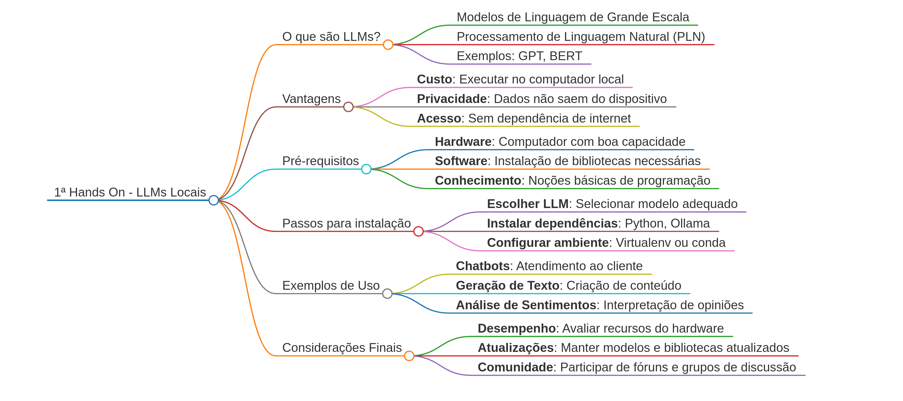

# 1º Hands on Python Floripa

Este repositório contém os códigos desenvolvidos durante o [1º Hands](https://www.meetup.com/floripa-python-meetup/events/306191610/?eventOrigin=group_upcoming_events) On da [Python Floripa](https://python.floripa.br/), realizado dia 22 de Fevereiro de 2025.

## Apresentação

Apresentação disponível emn [1º Hands On LLMs Locais- Rode IA no Seu Computador Sem Custos e com Privacidade.pdf](1HandsOnLLMsLocaisRodeIAnoSeuComputadorSemCustosecomPrivacidade.pdf).

## Mapa Mental

Aqui está o mapa mental do conteúdo abordado:



## 🚀 Como Usar

1. Clone o repositório:

```bash
git clone https://github.com/maxsonferovante/hands_on_python_floripa.git
```

2. Navegue até o diretório do projeto:

```bash
cd hands_on_python_floripa
```

3. Crie um ambiente virtual (recomendado):

```bash
python -m venv venv
source venv/bin/activate  # Linux/Mac
# ou
venv\Scripts\activate  # Windows
```

4. Instale as dependências (se houver):

```bash
pip install -r requirements.txt
```

## 🤝 Contribuindo

Sinta-se à vontade para contribuir com o projeto:

1. Faça um Fork do projeto
2. Crie sua Feature Branch (`git checkout -b feature/AmazingFeature`)
3. Commit suas mudanças (`git commit -m 'Add some AmazingFeature'`)
4. Push para a Branch (`git push origin feature/AmazingFeature`)
5. Abra um Pull Request
